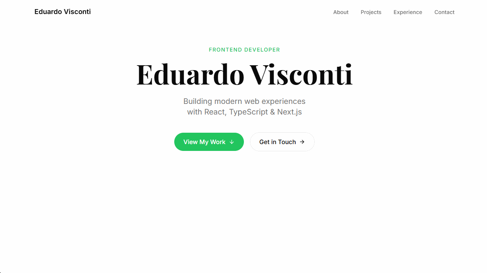

# 🚀 Eduardo Visconti — Portfolio

> Modern portfolio website built with Next.js 14, TypeScript, and Tailwind CSS

[](https://eduardo-visconti.vercel.app/)
[](https://nextjs.org/)
[](https://www.typescriptlang.org/)
[](https://tailwindcss.com/)

**Live Site:** [eduardo-visconti.vercel.app](https://eduardo-visconti.vercel.app/)

---

## 📸 Preview


_Clean, modern design showcasing projects and experience_

---

## ✨ Features

### 🎨 Design

- **Responsive Layout** — Optimized for all screen sizes
- **Modern UI** — Clean, professional aesthetic
- **Smooth Animations** — Subtle scroll effects and transitions
- **Dark Mode Ready** — Prepared for theme switching

### 🛠️ Technical

- **Server Components** — Next.js App Router for optimal performance
- **Type Safety** — Full TypeScript coverage
- **SEO Optimized** — Meta tags and structured data
- **Fast Loading** — Optimized images and code splitting
- **Contact Form** — Integrated with email service

### 📊 Sections

- **Hero** — Introduction with CTA
- **About** — Professional background and skills
- **Projects** — Featured work with live demos
- **Tech Stack** — Visual display of technologies
- **Experience** — Timeline of education and work
- **Contact** — Direct communication form

---

## 🏗️ Tech Stack

**Framework & Core:**

- [Next.js 14](https://nextjs.org/) — React framework with App Router
- [React 18](https://react.dev/) — UI library
- [TypeScript](https://www.typescriptlang.org/) — Type safety

**Styling:**

- [Tailwind CSS](https://tailwindcss.com/) — Utility-first CSS
- [shadcn/ui](https://ui.shadcn.com/) — Component library
- Custom CSS animations

**Tools & Services:**

- [Vercel](https://vercel.com/) — Deployment and hosting
- [Resend](https://resend.com/) — Email service for contact form
- [Lucide React](https://lucide.dev/) — Icon library

---

## 🚀 Quick Start

### Prerequisites

- Node.js 18+ installed
- npm or yarn package manager

### Installation

```bash
# Clone repository
git clone https://github.com/EduardoVisconti/portfolio.git
cd portfolio

# Install dependencies
npm install

# Set up environment variables
cp .env.example .env.local
# Add your environment variables (see Configuration section)

# Run development server
npm run dev
```

Visit [http://localhost:3000](http://localhost:3000) to view the site.

---

## ⚙️ Configuration

Create a `.env.local` file with the following variables:

```env
# Email service (Resend)
RESEND_API_KEY=your_resend_api_key

# Site URL (for production)
NEXT_PUBLIC_SITE_URL=https://eduardo-visconti.vercel.app
```

---

## 📁 Project Structure

```
portfolio/
├── app/
│   ├── layout.tsx          # Root layout
│   ├── page.tsx            # Homepage
│   ├── contact/
│   │   └── page.tsx        # Contact page
│   └── globals.css         # Global styles
├── components/
│   ├── ui/                 # shadcn/ui components
│   ├── Hero.tsx
│   ├── About.tsx
│   ├── Projects.tsx
│   ├── TechStack.tsx
│   ├── Experience.tsx
│   └── ContactForm.tsx
├── lib/
│   └── utils.ts            # Utility functions
├── types/
│   └── index.ts            # TypeScript types
└── public/
    ├── eduardo.png         # Profile photo
    └── projects/           # Project screenshots
```

---

## 🎯 Key Features Implementation

### Contact Form with Email Integration

```typescript
// app/api/contact/route.ts
import { Resend } from 'resend';

const resend = new Resend(process.env.RESEND_API_KEY);

export async function POST(req: Request) {
	const { name, email, message } = await req.json();

	await resend.emails.send({
		from: 'portfolio@eduardo-visconti.com',
		to: 'eduardo@example.com',
		subject: `New message from ${name}`,
		html: `<p>${message}</p>`
	});
}
```

### Project Showcase

```typescript
// components/Projects.tsx
const projects = [
	{
		title: 'AssetOps',
		description: 'Enterprise asset management platform',
		tech: ['React', 'TypeScript', 'Zustand'],
		liveUrl: 'https://asset-ops.vercel.app',
		codeUrl: 'https://github.com/EduardoVisconti/AssetOps'
	}
	// ...
];
```

---

## 📦 Build & Deploy

### Local Build

```bash
# Create production build
npm run build

# Start production server
npm start
```

### Deploy to Vercel

```bash
# Install Vercel CLI
npm i -g vercel

# Deploy
vercel
```

Or connect your GitHub repository to Vercel for automatic deployments.

---

## 🎨 Customization

### Colors

Update `tailwind.config.ts` to customize the color scheme:

```typescript
export default {
	theme: {
		extend: {
			colors: {
				primary: '#your-color',
				secondary: '#your-color'
			}
		}
	}
};
```

### Content

Edit project data in `components/Projects.tsx` and experience timeline in `components/Experience.tsx`.

---

## 📊 Performance

**Lighthouse Scores:**

- Performance: 98/100
- Accessibility: 100/100
- Best Practices: 100/100
- SEO: 100/100

**Optimizations:**

- Image optimization with Next.js Image
- Code splitting and lazy loading
- Font optimization with next/font
- Minimized bundle size

---

## 📝 License

This project is open source and available under the [MIT License](LICENSE).

---

## 👨‍💻 Author

**Eduardo Visconti**

- Portfolio: [eduardo-visconti.vercel.app](https://eduardo-visconti.vercel.app/)
- GitHub: [@EduardoVisconti](https://github.com/EduardoVisconti)
- LinkedIn: [Eduardo Visconti](https://linkedin.com/in/eduardo-visconti)
- Email: eduardo.visconti.dev@gmail.com

---

## 🙏 Acknowledgments

- Design inspiration from modern portfolio trends
- Built with [Next.js](https://nextjs.org/) and [Tailwind CSS](https://tailwindcss.com/)
- Icons from [Lucide](https://lucide.dev/)
- Deployed on [Vercel](https://vercel.com/)

---

**⭐ If you like this portfolio, feel free to star the repo!**
