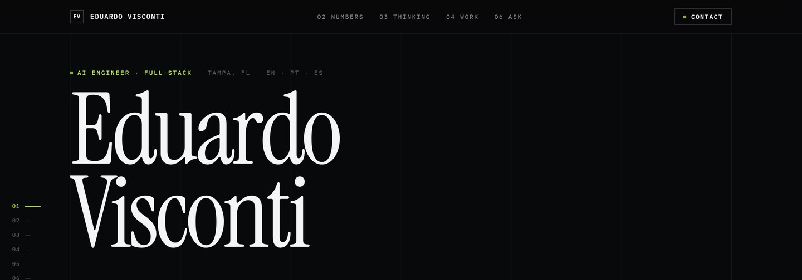
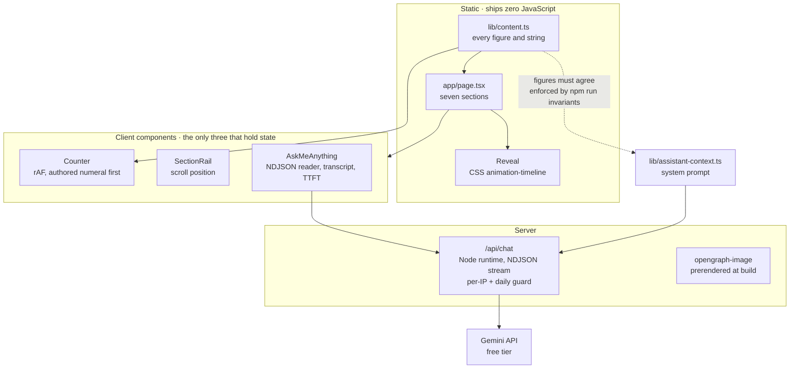

# eduardo-visconti.vercel.app

**The personal site of an AI engineer, built around the fact that his best work
cannot be shown.**

[](https://github.com/EduardoVisconti/portfolio/actions/workflows/ci.yml)


**[Live site →](https://eduardo-visconti.vercel.app)**

---

## Why this exists, and why it looks like this

Most portfolios are a grid of project cards. That format assumes the work can be
linked to. Here it mostly cannot: the flagship is a production platform whose
source is private, so a link grid would leave the strongest thing on the page as
a card with no href.

So the site argues three other ways instead.

**Verified figures, each with the period it was earned over.** A number without a
time denominator is a shrug, so every row carries its dates and the reader does
the division. 77 vendor-portal integrations means one thing over four years and
something else over five months.

**Three engineering decisions, written out in full.** Not a skills list. A claim
in display type, then the reasoning: why a deletion that is merely an absence
resurrects on the next sync, why a suite running in UTC cannot see
off-by-one-day bugs, why a layer rule that CI does not enforce is gone within a
month.

**The things a visitor can actually open.** Live apps, screens of real
interfaces, and a console that answers questions about the owner, backed by a
real model rather than a canned FAQ.

---

## Architecture



The dotted edge is the one that bites. Every figure on the page is stated as
fact, and the assistant states the same figures out loud to strangers. If one
changes in `lib/content.ts` and not in `lib/assistant-context.ts`, the assistant
contradicts the page with confidence. That pairing is checked mechanically
rather than remembered.

---

## How it works

**Content is data, not markup.** Every figure, every string and every work item
lives in `lib/content.ts`. Adding a project over the years is one appended
object, and the ledger layout absorbs it without a redesign. That is the whole
reason it is a ledger and not a card grid.

**Motion ships no JavaScript.** Scroll reveals use CSS `animation-timeline:
view()`, with an `@supports not` fallback that leaves content visible rather than
stranded at `opacity: 0`. Exactly three components are client components, and
the build fails if a fourth appears.

**Numbers render before they animate.** `Counter` puts the authored numeral in
the DOM as real text and swaps it only once the animation actually begins, so a
failed visibility check can never leave a headline figure blank. There is
deliberately no timeout backstop: a timer armed on mount fires for every counter
still below the fold and marks it started, disabling the animation it was meant
to protect.

**The console is real.** `/api/chat` runs on Gemini's free tier, on the Node
runtime, because the site
has to work without a paid API account. The route is public and unauthenticated,
so it carries a per-IP sliding window and a daily ceiling, and a request that is
turned away spends neither budget. Both counters are per-instance and therefore
soft; a hard limit belongs at the edge.

The answer arrives as NDJSON, one JSON object per line, so the transcript paints
a token at a time and the telemetry row reports time to first token rather than
a round trip the visitor would otherwise sit through. The frame carries an
explicit completion marker, because a stream that simply ends is
indistinguishable from one the network cut in half - and a half-written answer
must not be committed to the history and replayed to the model as something it
had finished saying. The parser is unit-tested against split chunks, malformed
lines and a byte-at-a-time delivery; the model call above it is not, and cannot
be without a live key.

**There is no contact form.** Delivering mail needs a verified sending domain and
this site does not own one. A form that fails silently is worse than a link that
works, so section 07 is an email address and two links.

---

## Getting started

```bash
npm ci
cp .env.example .env.local   # GEMINI_API_KEY — free, no card, aistudio.google.com/apikey
npm run dev
```

Without the key the console returns `503` and says so plainly rather than
pretending to be live.

| Command | What it does |
| --- | --- |
| `npm run dev` | Development server |
| `npm run invariants` | The design rules, enforced |
| `npm run typecheck` | `tsc --noEmit` |
| `npm run lint` | `eslint . --max-warnings=0` |
| `npm run build` | Production build |

---

## Gates

Every pull request runs, and must pass:

- **invariants** — the rules in [`CONTRIBUTING.md`](CONTRIBUTING.md), as a script
- **typecheck, lint, build**
- **gitleaks** — secret scan over full history
- **osv-scanner** — dependency advisories
- **lychee** — every external URL the page claims still resolves

The last one earns its place: every claim here is a link out, a 404 costs more
than a lint error, and nothing else in the pipeline would catch it.

A scheduled workflow opens an issue on the 3rd of each month to re-derive the
figures. They go stale silently, and a stale number stated as fact is a wrong
one.

---

## Project layout

```
app/
  page.tsx              seven sections, in order
  layout.tsx            fonts, metadata, JSON-LD
  opengraph-image.tsx   share card, prerendered at build
  robots.ts sitemap.ts
  api/chat/route.ts     the console: NDJSON stream, rate guard
components/             fifteen; three hold state
lib/
  content.ts            single source of truth for every figure and string
  assistant-context.ts  the assistant's system prompt, mirrors content.ts
scripts/invariants.mjs  the gate
public/
  work/                 interface screens
  resume.pdf  llms.txt
```

---

## Contributing

One person maintains this, so [`CONTRIBUTING.md`](CONTRIBUTING.md) is short and
covers only the rules whose violation is expensive and silent. If you disagree
with a rule, change the rule and its check together. A rule that lives only in
prose is a rule that decays, which is the argument the site itself makes.

## License

No license. All rights reserved — this is a personal site, not a template.
